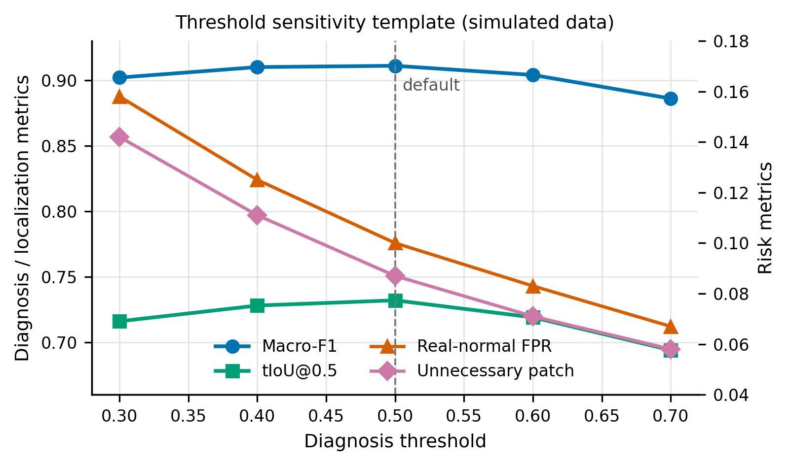

# VideoGenDoctor 论文全方位优化报告

## 1. 总体评价

论文的核心定位较清晰：VideoGenDoctor 不是新的视频生成模型，而是面向可控视频生成的结构化诊断与修复规划接口。当前稿件已经具备投稿所需的主要要素，包括明确的 failure-as-code 表示、受控诊断 fixture、真实生成器失败子集、直接 VLM 基线、闭环修复评估、盲评人类验证、消融实验、置信区间和若干压力测试。

主要优势在于问题定义具体，接口输出可审计，实验链路覆盖诊断、定位、修复计划和人类验证。主要风险在于审稿人可能质疑 controlled fixture 与真实开放场景之间的外推边界、修复计划与真实可执行补丁之间的差异、真实失败子集的 failure-enriched 采样不能估计自然失败率，以及部分表格标题仍带有版本扩展痕迹。主稿已针对这些风险进行了收敛式修改。

## 2. 主要问题与修改建议

1. 开放世界泛化边界需要更早、更直接地说明。
修改方案：摘要末句、引言 Scope 和 Discussion 中均应明确当前结果支持 controlled diagnosis 和 failure-enriched transfer，不证明任意生成器、任意时长和任意领域的 open-world coverage。主稿已将摘要末句改为不建立开放世界覆盖的表述。

2. 修复计划有效性与后端可执行性容易混淆。
修改方案：在方法 Overview 后加入 plan validity 与 adapter executability 的定义边界。主稿已新增说明：plan valid 表示动作、目标和 evidence span 合法；executable 取决于下游生成器或编辑器是否暴露相应控制接口。

3. 实验结论中“闭环”贡献需避免过度归因。
修改方案：把 VideoGenDoctor-full 的增益解释为诊断、模板化修复计划、验证和工作流集成的联合结果；对于 Patch+Judge 与 Full loop 的小差异，保持“不具有决定性”的解释。主稿已保留并强化 paired bootstrap 的谨慎表述。

4. 真实失败子集不能用于估计自然失败率。
修改方案：所有涉及 real-failure subset 的表述都应说明其 failure-enriched、balanced-by-construction，只用于 transfer check。主稿和表注已统一强调这一点。

5. 统计检验说明应前置到 Metrics。
修改方案：在 Compared Methods and Metrics 中加入 paired bootstrap differences 的解释，并说明置信区间跨 0 时小点估计不作强结论。主稿已补充该句。

## 3. 次要问题与修改建议

1. 多处表题使用 “expanded”，容易暴露版本演进痕迹。
修改方案：统一改为 controlled fixture、evaluation sets 或 failure-enriched real-generator subset。主稿已替换主要 caption 和相关附录 caption。

2. 源文件中保留未使用的 `TBD` 宏，容易影响源文件审阅观感。
修改方案：删除未使用的 `\TBD` 和 `\todoresult` 宏。主稿已删除。

3. 相关工作略短。
修改方案：如版面允许，可增加一段“视频编辑与迭代生成控制”的相关工作，用于区分 VideoGenDoctor 的贡献不是编辑器本身，而是把评估信号结构化为修复计划。

4. Human Pass@K 的评估细节主要在附录。
修改方案：主文已说明盲评设置，但可在补充材料中进一步说明 raters 数量、majority vote、评分尺度和新 artifact 判定规则。附录已有相关内容，建议投稿前检查是否与主文表格完全一致。

## 4. 语言润色与去 AI 化建议

已执行的去 AI 化方向包括：减少泛化性强但证据不足的表达，避免 “supports broad generality” 一类容易被审稿人攻击的句式；删除 “expanded” 等版本修订痕迹；将 “demonstrates/solves” 类强动词替换为 “supports/suggests/provides an initial check”等更符合证据边界的表述。

后续全稿仍建议继续检查三类句子：第一，包含 “broad”, “general”, “comprehensive”, “open-world” 的句子是否有足够实验支撑；第二，包含 “main gain comes from” 的句子是否严格对应消融结果；第三，图表分析段是否只是重复数字，应尽量解释这些数字如何回答引言中的三个问题。

## 5. 图表标题与可视化优化建议

建议保留为表格的内容：taxonomy、operator-template alignment、per-code reliability、patch adapter details。这些内容是结构化审计信息，表格更适合精确查阅。

建议保留或强化为图的内容：confusion matrix 应继续使用热力图；temporal evidence distribution 应继续使用时间分布图和热力图；closed-loop repair comparison 适合分组柱状图，主稿已有对应 figure；cost-performance trade-off 更适合 Pareto scatter plot，横轴为 relative cost 或 relative latency，纵轴为 Human Pass@2，可标注 VideoGenDoctor-full 与 Rule+GPT-4V 的成本收益差异。该建议已执行：已基于主稿 Table~\ref{tab:cost_performance} 的真实数据生成 `cost_performance_pareto.pdf/png`，并插入 NeurIPS 附录。

可新增图：threshold sensitivity curve。横轴为诊断阈值或 verifier 阈值，纵轴同时展示 Macro-F1、tIoU@0.5、real-normal FPR 和 unnecessary patch rate。该图能回应审稿人对阈值选择和鲁棒性的质疑。

模拟数据示意图如下，仅用于展示未来补实验的图表结构，不能作为真实实验结果写入论文。



## 6. 实验设计优化建议

1. 参数敏感性分析。
目的：验证阈值 $\tau$、Stage-2 权重 $\alpha$ 和 top-$K$ candidate segments 是否影响结论。
变量：$\tau \in \{0.3,0.4,0.5,0.6,0.7\}$，$\alpha \in \{0.0,0.3,0.6,0.9\}$，$K \in \{1,3,5\}$。
指标：Macro-F1、tIoU@0.5、Human Pass@2、real-normal FPR、unnecessary patch rate。
展示：折线图或小型热力图。

2. Adapter executability 分层实验。
目的：区分 repair-plan quality 和真实可执行 patch 的收益。
变量：L0/L1/L2/L3 adapter level，或者按生成器分组。
指标：patch vocabulary validity、adapter-executable rate、Human Pass@2、new-artifact rate。
展示：堆叠柱状图或分组柱状图。

3. 更强真实失败验证。
目的：降低 controlled perturbation 过拟合质疑。
变量：新增生成器、长视频、不同风格域、不同 prompt 复杂度。
指标：Macro-F1、tIoU@0.5、Human Pass@2、FPR。
展示：per-generator 表格加置信区间，或按域分面的柱状图。

4. 多标注者稳定性。
目的：补强 evidence span 主观性问题。
变量：至少 3 名标注者，比较 majority vote 与 adjudication。
指标：Fleiss' $\kappa$、mean pairwise tIoU、boundary disagreement。
展示：箱线图或表格。

## 7. 审稿人视角评议

优点：论文提出的 code--span--target--plan 接口有明确问题价值，能够把视频生成评估从全局打分推进到可审计诊断与修复计划；实验不仅报告诊断分数，也覆盖闭环修复、人类盲评、真实失败子集和消融分析；论文对 open-world claim 的边界处理比一般系统论文更谨慎。

主要问题：第一，controlled fixture 与 naturally occurring failures 的关联仍可能被认为不足，尤其是 failure-enriched subset 不能说明真实部署中的失败分布。第二，repair plan 到 executable patch 的落地程度取决于后端能力，若不分层呈现，会削弱“repair”主张。第三，真实失败集和人类评估规模仍偏有限，尤其是按生成器、按错误类型切分后样本量更小。

次要问题：相关工作可以进一步区分 video evaluation、VLM critique、video editing/control 和 program repair；部分表格较密，建议在主文保留最能回答研究问题的表，把审计性表格放附录；图注应继续避免版本痕迹和过强结论。

综合评分建议：7/10，偏弱接收到接收边界。若补充阈值敏感性、adapter executability 分层和更清晰的真实失败构造协议，可信度可明显提升。

## 8. 根据审稿意见修改后的示例文本

已插入摘要末句：

```latex
These results support auditable repair records as a practical interface for controlled diagnosis and repair planning, but they do not establish open-world coverage across arbitrary generators, domains, or video lengths.
```

已插入方法 Overview：

```latex
We distinguish repair-plan validity from adapter executability: a plan is valid when it names a supported action, target, and evidence span, while it is executable only when the downstream generator or editor exposes the required control interface.
```

已插入 Metrics：

```latex
For paired repair comparisons, we report bootstrap differences and treat small point estimates as inconclusive when the confidence interval crosses zero.
```

建议后续可插入 Discussion 的补充句：

```latex
The real-generator subset is best interpreted as a stress-oriented transfer set rather than a deployment distribution, because samples are retained after visible failure verification and balanced across generators.
```

## 9. 需要补充的数据或实验清单

1. 阈值敏感性：$\tau$、$\alpha$、top-$K$ 对诊断、定位、FPR 和修复成功率的影响。
2. Adapter executability：按 L0/L1/L2/L3 或按生成器统计真实可执行比例与 Human Pass@2。
3. 真实失败数据置信区间：为 real-failure subset 的 Macro-F1、tIoU@0.5、Human Pass@2 增加 bootstrap CI。
4. 多标注者可靠性：从 2 名标注者扩展到 3 名或更多，报告 Fleiss' $\kappa$ 和 span boundary disagreement。
5. 长视频或多镜头压力测试：至少增加一个长视频或多 shot 子集，用于支持长时序场景下的边界讨论。

## 10. 模拟数据示例（模拟数据）

以下数据仅用于展示阈值敏感性实验的表格结构和合理趋势，不能作为真实实验结果写入论文。

| 阈值 $\tau$ | Macro-F1 | tIoU@0.5 | Real-normal FPR | Unnecessary patch rate | Human Pass@2 |
|---:|---:|---:|---:|---:|---:|
| 0.30 | 0.902 | 0.716 | 0.158 | 0.142 | 0.742 |
| 0.40 | 0.910 | 0.728 | 0.125 | 0.111 | 0.758 |
| 0.50 | 0.911 | 0.732 | 0.100 | 0.087 | 0.764 |
| 0.60 | 0.904 | 0.719 | 0.083 | 0.071 | 0.741 |
| 0.70 | 0.886 | 0.694 | 0.067 | 0.058 | 0.706 |

生成依据：较低阈值召回更多失败但增加误报和不必要修复；中等阈值在诊断召回、定位质量和修复风险之间取得较好平衡；较高阈值降低误报但漏检增加，导致 Human Pass@2 下降。
